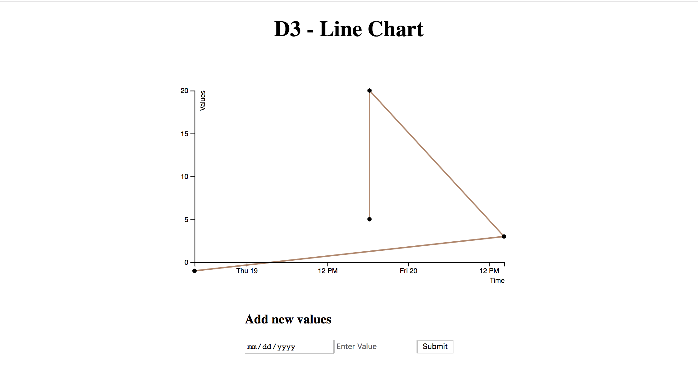

#### Instructions to run the app

## [Demo](https://reactd3linechart-zmxvctngkz.now.sh/)
## Step 1 - Dependencies

You will need:

* [Git](http://git-scm.com/downloads)
* [node](https://nodejs.org/) or
* [yarn](https://yarnpkg.com/en/docs/install)

Please install them if you don't have them already.

## Step 2 - Clone the repository:

From the command line, clone the repository:

```sh
$ https://github.com/TanveerAliS/react-d3-linechart.git
```

## Step 3 - Install dependencies

```sh
$ cd react-d3-linechart-master
$ npm install
```

This will install all the dependencies for all of the exercises, _it might take a while_.

## Step 4 - Run an app

To run, first `cd` into the directory:

Then run it

```sh
npm start
```

Your browser should open up to a running app that looks like this:


Good luck, and have fun!
